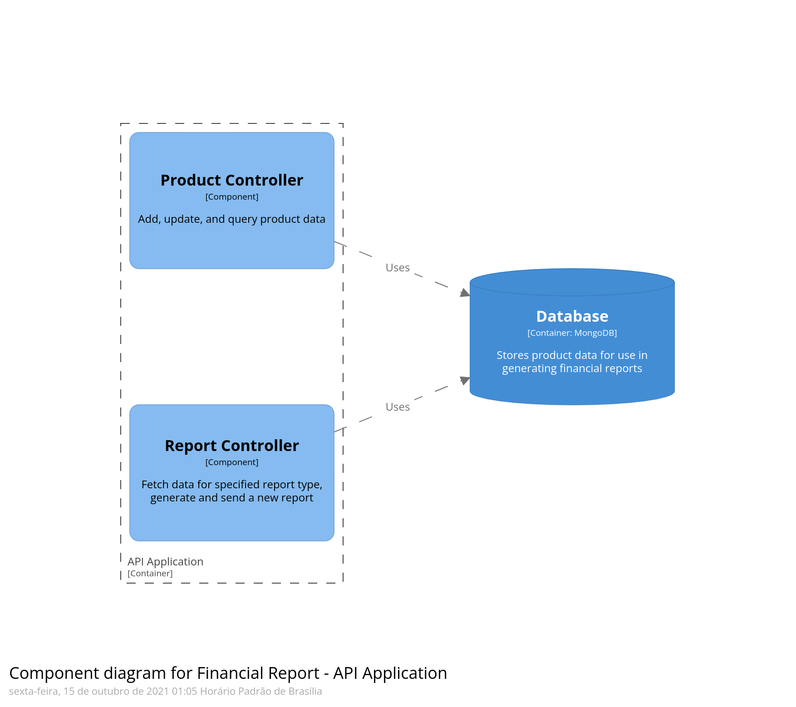

< [voltar](../README.md)

## Arquitetura com C4 Model

> _"O modelo C4 consiste em um conjunto hierárquico de diagramas de arquitetura de software para Contexto, Contêineres, Componentes e Código"_ [^1]

[Explicação do Modelo](https://youtu.be/v-taFyrNXJY) por Otavio Lemos

### Tipos de visão

#### Contexto

#### Container

#### Componente

Para visualizar o diagrama usando a linguagem DSL visite o [simulador](https://structurizr.com/dsl) e cole o código `.dsl` que está em [workspace.dsl](./workspace.dsl)

[^1]: https://www.infoq.com/br/articles/C4-architecture-model/?itm_source=infoq_en&itm_medium=link_on_en_item&itm_campaign=item_in_other_langs
